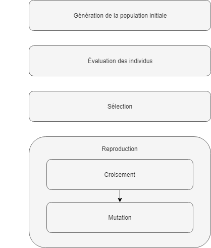

= Introduction aux Algorithmes Génétiques

== Évolution Darwinienne

[%step]
* Sélection : Elimination naturelle des individus les moins aptes à survivre dans leur environnement
* Hérédité : Un processus par lequel les enfants reçoivent les propriétés de leurs parents
* Variation : Il doit exister un moyen d'introduire une variation des traits présents dans la population

== Qu'est ce qu'un algorithme génétique
Une méthode de recherche heuristique qui s'inspire de l'évolution darwinienne

== Génération de la population initiale (1/4)
Création de N individu représentant une solution potentiel

== Evaluation des individus (2/4)
Définir une fonction de +fitness+

== Sélection (3/4)
Choix des individus qui donneront naissance à la prochaine génération 

=== L'Élitisme
Séléction des meilleurs individus de la population

=== La Roue de la fortune

== Reproduction (4/4)

=== Croisement
Création d'un individu à partir du code génétique des parents

=== Mutation
Modification aléatoire de l'information génétique de quelques individus

== Démo

== Récap

== Des questions ? GIYF !

== Merci